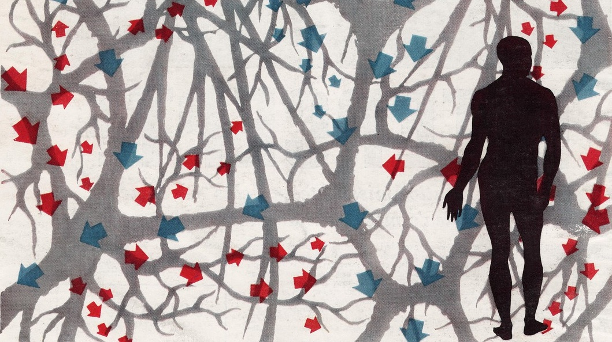

Java has a lot of different ways to represent a stream of bytes.  Depending on the author and age of a library, it might use `byte[]`, `InputStream`, `ByteBuffer`, or `ReadableByteChannel`.  If the bytes represent strings, there's also `String`, `Reader`, and `CharSequence` to worry about.  Remembering how to convert between all of them is a thankless task, made that much worse by libraries which define their own custom representations, or composing them with Clojure's lazy sequences.

This library is a Rosetta stone for all the byte representations Java has to offer, and gives you the freedom to forget all the APIs you never wanted to know in the first place.  Complete documentation can be found [here](http://ideolalia.com/byte-streams/byte-streams.html).

### usage

```clj
[byte-streams "0.1.12"] 
```

### converting types

To convert one byte representation to another, use `byte-streams/convert`:

```clj
byte-streams> (convert "abcd" java.nio.ByteBuffer)
#<HeapByteBuffer java.nio.HeapByteBuffer[pos=0 lim=4 cap=4]>
byte-streams> (convert *1 String)
"abcd"
```

`(convert data to-type options?)` converts, if possible, the data from its current type to the destination type.  This destination type can either be a Java class or a Clojure protocol.  However, since there's no direct route from a string to a byte-buffer, under the covers `convert` is doing whatever it takes to get the desired type:

```clj
byte-streams> (conversion-path String java.nio.ByteBuffer)
([java.lang.String [B] 
 [[B java.nio.ByteBuffer])
```

While we can't turn a string into a `ByteBuffer`, we can turn a string into a `byte[]`, and `byte[]` into a `ByteBuffer`.  When invoked, `convert` will choose the minimal path along the graph of available conversions.  Common conversions are exposed via `to-byte-buffer`, `to-byte-buffers`, `to-byte-array`, `to-input-stream`, `to-readable-channel`, `to-char-sequence`, `to-string`, and `to-line-seq`.  

Every type can exist either by itself, or as a sequence.  For instance, we can create an `InputStream` representing an infinite number of repeated strings:

```clj
byte-stream> (to-input-stream (repeat "hello"))
#<ChannelInputStream sun.nio.ch.ChannelInputStream@5440bbb4>
```

And then we can turn that into a lazy sequence of `ByteBuffers`:

```clj
byte-streams> (take 2 
                (convert *1 
                  (seq-of java.nio.ByteBuffer) 
                  {:chunk-size 128}))
(#<HeapByteBuffer java.nio.HeapByteBuffer[pos=0 lim=128 cap=128]> 
 #<HeapByteBuffer java.nio.HeapByteBuffer[pos=0 lim=128 cap=128]>)
```

Notice that we describe a sequence of a type as `(seq-of type)`, and that we've passed a map to `convert` describing the size of the `ByteBuffers` we want to create.  Available options include:

* `:chunk-size` - the size in bytes of each chunk when converting a stream into a lazy seq of discrete chunks, defaults to `4096`
* `:direct?` - whether any `ByteBuffers` which are created should be [direct](http://stackoverflow.com/a/5671880/228387), default to `false`
* `:encoding` - the character set for any strings we're encoding or decoding, defaults to `"UTF-8"`

### custom conversions

While there are conversions defined for all common byte types, this can be extended to other libraries via `byte-streams/def-conversion`:

```clj
;; a conversion from byte-buffers to my-byte-representation
(def-conversion [ByteBuffer MyByteRepresentation] 
  [buf options]
  (buffer->my-representation buf options))

;; everything that can be converted to a ByteBuffer is transitively fair game now
(convert "abc" MyByteRepresentation)
```

This mechanism can even be used for types unrelated to byte streams, if you're feeling adventurous.

### transfers

Simple conversions are useful, but sometimes we'll need to do more than just keep the bytes in memory.  When you need to write bytes to a file, network socket, or other endpoints, you can use `byte-streams/transfer`.

```clj
byte-streams> (def f (File. "/tmp/salutations"))
#'byte-streams/f
byte-streams> (transfer "hello" f {:append? false})
nil
byte-streams> (to-string f)
"hello"
```

`(transfer source sink options?)` allows you pipe anything that can produce bytes into anything that can receive bytes, using the most efficient mechanism available.  Custom transfer mechanisms can also be defined:

```clj
(def-transfer [InputStream MyByteSink]
  [stream sink options]
  (send-stream-to-my-sink stream sink))
```

### some utilities

`byte-streams/print-bytes` will print both hexadecimal and ascii representations of a collection of bytes:

```clj
byte-streams> (print-bytes (-> #'print-bytes meta :doc))
50 72 69 6E 74 73 20 6F  75 74 20 74 68 65 20 62      Prints out the b
79 74 65 73 20 69 6E 20  62 6F 74 68 20 68 65 78      ytes in both hex
20 61 6E 64 20 41 53 43  49 49 20 72 65 70 72 65       and ASCII repre
73 65 6E 74 61 74 69 6F  6E 73 2C 20 31 36 20 62      sentations, 16 b
79 74 65 73 20 70 65 72  20 6C 69 6E 65 2E            ytes per line.
```

`(byte-streams/compare-bytes a b)` will return a value which is positive if `a` is lexicographically first, zero if they're equal, and negative otherwise:

```clj
byte-streams> (compare-bytes "abc" "abd")
-1
```

`bytes-streams/bytes=` will return true if two byte streams are equal, and false otherwise.

`byte-streams/conversion-path` returns all the intermediate steps in transforming one type to another, if one exists:

```clj
;; each element is a conversion tuple of to/from
byte-streams> (conversion-path java.io.File String)
([java.io.File java.nio.channels.ReadableByteChannel] 
 [#'byte-streams/ByteSource java.lang.CharSequence] 
 [java.lang.CharSequence java.lang.String])

;; but if a conversion is impossible...
byte-streams> (conversion-path java.io.OutputStream java.io.InputStream)
nil
```

`byte-streams/possible-conversions` returns a list of possible conversion targets for an object or type:

```clj
byte-streams> (possible-conversions String)
(java.lang.String java.io.InputStream java.nio.DirectByteBuffer java.nio.ByteBuffer (seq-of java.nio.ByteBuffer) java.io.Reader java.nio.channels.ReadableByteChannel [B java.lang.CharSequence)

;; we can ask the same of an instance of that type
byte-streams> (possible-conversions "abc")
(java.lang.String java.io.InputStream java.nio.DirectByteBuffer java.nio.ByteBuffer (seq-of java.nio.ByteBuffer) java.io.Reader java.nio.channels.ReadableByteChannel [B java.lang.CharSequence)
```

`byte-streams/optimized-transfer?` returns true if there is an optimized transfer method for two types:

```clj
byte-streams> (optimized-transfer? String java.io.File)
true
```

### license

Copyright © 2013 Zachary Tellman

Distributed under the [MIT License](http://opensource.org/licenses/MIT)
